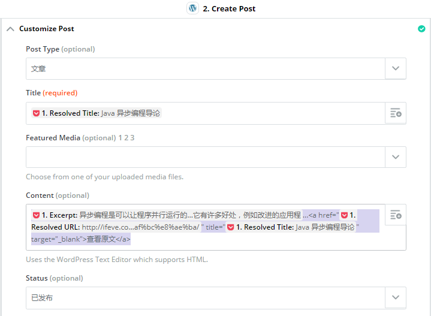
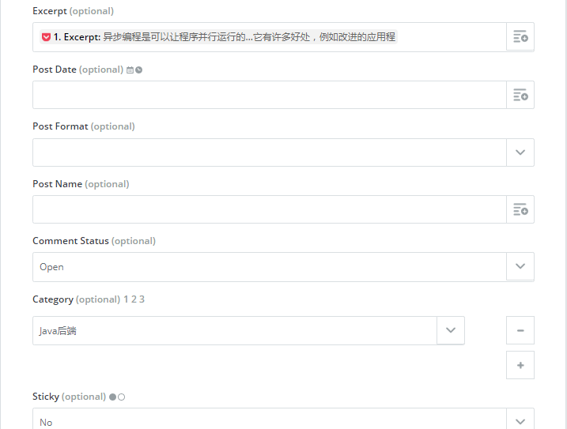

## 如何在 PC 上通过 Pocket 标记文章分享到派三派四博客？
这篇文章主要是介绍 PC(windows) 上怎样通过 Pocket 标记文章分享到派三派四博客。

### 准备工作
- Pocket 账号
- 派三派四博客账号
- zapier 账号

### 借助 zapier 实现将 Pocket 标记的文章分享到派三派四博客

#### 1 登陆 zapier 网站
国外的网站，打开速度有点慢。 

#### 2 创建应用
页面点击 [My Apps]，如下图：

分别创建 pocket 应用和派三派四博客应用（后台是 WordPress 搭建），并且用自己的账号完成授权认证。如下图所示：

#### 3 创建工作流
页面选择 [Make a Zap]，如下图：
 

创建触发条件步骤 pocket 和执行动作 WordPress 两大步骤，分别对应自己上面创建的应用。并按照提示将每个小步骤的必填选项全部填好。如图所示：

设置 WordPress 执行动作时，会麻烦一些。请耐心设置，一些选项不懂的话可以设置好后，再查看效果。不满意可以再次修改。下面给出一个参考示例：

主要是 Content 选项的设置，影响博客显示的内容，可以参考图片的设置。其中一些不重要的选项可以留空。

最后，一定将创建的工作流激活。至此就完成了整个的配置，非常的简单。
#### 4 验证
完成配置后，可以通过 pocket 标记文章的操作，从而触发 zapier 的工作流，自动将文章分享到派三派四博客。主意：可以使用谷歌浏览器装一下 pocket 的插件，就可以非常方便的标记网页文章到 pocket 了。  

注意：分享的动作会稍有延迟，请等待几分钟后再去验证。同时分享的记录在 zapier 也可以查到，以此可以验证配置是否无误。 